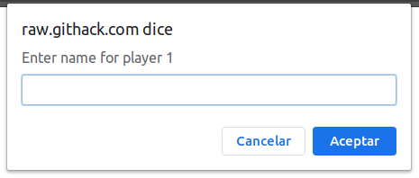
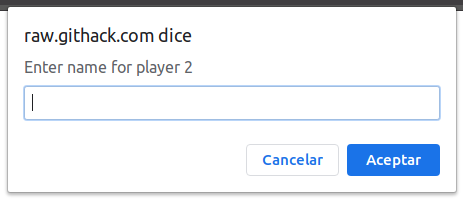
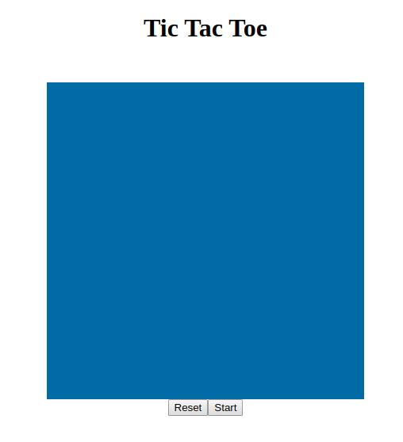
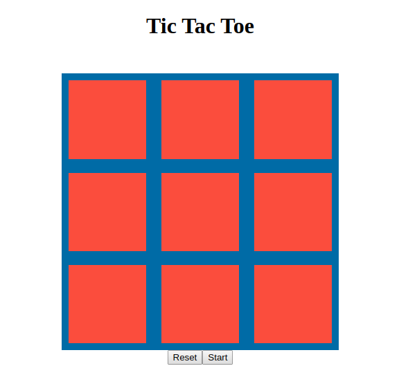

# Tic Tac Toe

> This project consists of building a Tic Tac Toe game with JavaScript to render it in a web browser. This project follows
> the lessons about Factory Functions and The Module Pattern. So the main goal is to put in practice those concepts along
> with the main concepts of OOP. Particularly classes, objects, and how to access their methods and attributes.

Additional description of the project and its features.
[The Odin project](https://www.theodinproject.com/courses/javascript/lessons/tic-tac-toe-javascript)

## Built With

- JavaScript, HTML, CSS3

## Live Demo

[Live Demo Link](https://raw.githack.com/oscardelalanza/literate-parakeet/feature/game/index.html)

## Getting Started

### How to play

#### Setting player names

When you load the game in your browser, it will pop up two consecutive `inputs` for setting the `player 1` and `player 2`
names respectively. Fill the input and confirm the name by clicking `accept`.
  

#### The game board
After setting up the player names, you will be redirected to an empty board. Notice the buttons at the bottom of the board
`Reset` and `start`

- `Reset` button will let you restart the game and set up the player names again.
- `Start` button will start the Tic Tac Toe game. So just click on the red squares and enjoy!

> To get a local copy up and running follow these simple example steps.
 
### Prerequisites

- `git`

### Setup

To clone the project into your local environment do the following

- open a new `terminal` window and navigate to the directory where the project will be stored
- run the command `git clone git@github.com:oscardelalanza/Tic-Tac-Toe-js.git`
- run the command `cd Tic-Tac-Toe-js` to enter to the project directory

### Install

To install the requires packages do the following

- inside `Tic-Tac-Toe-js` directory run the command `npm install`

### Usage

To start the local development server do the following

- open `index.html` 

### Run tests

- no written tests yet

## Authors

👤 **Mark Baidebura**

- Github: [@webmarkyn](https://github.com/webmarkyn)

👤 **Oscar De La Lanza**

- Github: [@oscardelalanza](https://github.com/oscardelalanza)
- Twitter: [@oscardelalanza](https://twitter.com/oscardelalanza)
- Linkedin: [oscardelalanza](https://linkedin.com/oscardelalanza)
- Email: oscardelalanza@gmail.com

## Show your support

Give a ⭐️ if you like this project!

