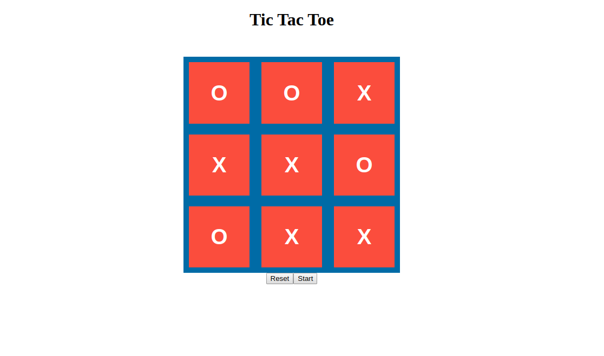

# Tic Tac Toe

> This is a project from Microverse
> In this project, the student builds a Tic Tac Toe game (Again) but this time it’ll be rendered in the browser. 
> No backend. This project follows the lesson about Factory Functions and The Module Pattern so the main goal is to put 
> into practice those concepts along with the main concepts of Object Oriented Programming. Particularly, classes/objects 
> and how to access their methods and attributes.

Additional description about the project and its features.
[The Odin project](https://www.theodinproject.com/courses/javascript/lessons/tic-tac-toe-javascript)

## Built With

- JavaScript, HTML, CSS3

## Live Demo

[Live Demo Link](https://raw.githack.com/oscardelalanza/literate-parakeet/feature/game/index.html)

## Getting Started

**This is an example of how you may give instructions on setting up your project locally.**
**Modify this file to match your project, remove sections that don't apply. For example: delete the testing section if the currect project doesn't require testing.**

To get a local copy up and running follow these simple example steps.
on your console run the command `git clone git@github.com:oscardelalanza/literate-parakeet.git`
the `cd literate-parakeet` and open `index.html`

### Prerequisites
`web browser`

## Authors

👤 **Mark Baidebura**

- Github: [@webmarkyn](https://github.com/webmarkyn)

👤 **Oscar De La Lanza**

- Github: [@oscardelalanza](https://github.com/oscardelalanza)
- Twitter: [@oscardelalanza](https://twitter.com/oscardelalanza)
- Linkedin: [oscardelalanza](https://linkedin.com/oscardelalanza)

## Show your support

Give a ⭐️ if you like this project!

